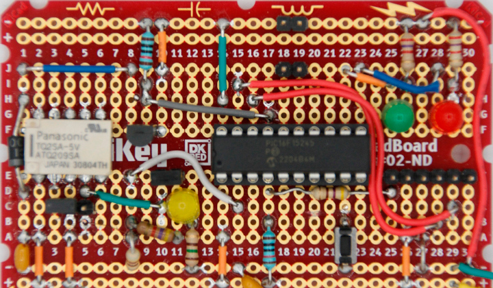

<!-- Please do not change this logo with link -->

<a target="_blank" href="https://www.microchip.com/" id="top-of-page">
   <picture>
      <source media="(prefers-color-scheme: light)" srcset="images/mchp_logo_light.png" width="350">
      <source media="(prefers-color-scheme: dark)" srcset="images/mchp_logo_dark.png" width="350">
      
   </picture>
</a>

# Detecting Relay Failures with the PIC16F15245 MCU

Electro-mechanical relays are a common component used to isolate power or signals. However, relays can fail over time due to mechanical wear, electrical contacts wearing out, armatures jamming, or burned out coils. This example shows a simple way to detect a failed relay using the Analog to Digital Converter (ADC) with the PIC16F15245 microcontroller. For additional reliability, class B functional safety libraries are also used to verify the microcontroller is operating correctly. 

## Related Documentation

<!-- Any information about an application note or tech brief can be linked here. Use unbreakable links!
     In addition a link to the device family landing page and relevant peripheral pages as well:
     - [AN3381 - Brushless DC Fan Speed Control Using Temperature Input and Tachometer Feedback](https://microchip.com/00003381/)
     - [PIC18F-Q10 Family Product Page](https://www.microchip.com/design-centers/8-bit/pic-mcus/device-selection/pic18f-q10-product-family) -->

## Software Used

- MPLAB® X IDE 6.20.0 or newer [(MPLAB® X IDE 6.20)](https://www.microchip.com/en-us/development-tools-tools-and-software/mplab-x-ide)
- MPLAB XC8 2.46.0 or newer compiler [(MPLAB® XC8 2.46)](https://www.microchip.com/en-us/tools-resources/develop/mplab-xc-compilers/xc8)
- MPLAB Code Configurator (MCC)
- PIC16F1xxxx_DFP v1.25.389

## Hardware Used

See BOM Document
- Microcontroller: [PIC16F15245](#)

  

## Setup

For demonstration purposes, the following design was assembled on a protoboard.

  

**Note: Component values are application specific. Please see the Design Procedure section for more information.**

## Self-Tests

### Functional Safety Class B Library

- CPU  

This test verifies the CPU registers are operating correctly.

- Flash

This test verifies the Flash program memory matches the expected checksum.

- SRAM

This test verifies the SRAM is functioning correctly at Power-on-Reset (POR), and periodically scans each memory bank at runtime.

- Stack

This test verifies the hardware stack in the microcontroller is operating correctly.

- Watchdog

This test verifies the WDT hardware is operational at POR.  

### Other

- Transistor Short to GND/VDD

If the PORT value (digital input) on the transistor pin does not match the expected `LAT` state (digital output), then the transistor has failed short to VDD or GND.

**Note: If the relay coil runs from a voltage higher than the microcontroller (ex: +12V), then a short to VDD could expose the microcontroller to this voltage.**

- Relay Jammed

If the relay does not transition to the correct state within the time limits set, then the relay is considered to be jammed.

- Unexpected power applied to/missing from output

This occurs if the relay is in the open state, and a voltage is detected or if the relay is in a closed state, and no voltage is detected. 

- Bad Connection / Brownout

If the relay is in a steady state OPEN/CLOSED, and the voltage is at an invalid level, then the device reports a brownout or bad connection. 

- SRAM Variables Corruption

If the `relayState` or `errorState` variables mismatch from a copy `relayState2` or `errorState2`, then the device reports a self-test failure.

## Theory of Operation

This application controls and monitors an electromechanical relay to ensure the relay contacts have not jammed and are switching correctly. A simple state machine is used to keep track of the state of the relay.  

**Note: The relay used in this example is non-latching.**

On POR, the microcontroller starts in the `OPEN` state. Every five seconds, the microcontroller gets an interrupt from Timer 2 to switch the relay ON/OFF. When this occurs, the microcontroller transitions to the `RELAY_OPEN_TRANSITION_CLOSED` or `RELAY_CLOSE_TRANSITION_OPEN` state and switches the relay coil transistor ON or OFF. 

When switched, relay contacts bounce for a few milliseconds. The ADC constantly monitors the output, but in these transition states, the output is ignored for a few milliseconds (see relay datasheet) to avoid contact bounce. The delay time is controlled by `RELAY_CLOSE_TIME_MAX` and `RELAY_OPEN_TIME_MAX`. After these have elapsed, the relay must reach the desired state within `RELAY_MARGIN` milliseconds, or it will be considered a malfunction. If a malfunction occurs, the relay will cease switching until the pushbutton is pressed.

To determine the relay state, two constants `ADC_THRESHOLD_HIGH` and `ADC_THRESHOLD_LOW` are used as thresholds for ON and OFF. The PIC16F15244 family of microcontrollers have a 10-bit ADC and a Fixed Voltage Reference (FVR). To convert a voltage into a threshold, the following formula can be used:

DIGITAL = VAN* 2N / VREF

Where:
- VAN is the value to convert
- N is the number of bits in the ADC
- VREF is the reference voltage of the ADC  

## Error Flags

A bit mask of error flags are defined to detect if an error occurs.

| Bit Number | Flag Name | Description
| ---------- | --------- | ------------
| 7 | Unused | N/A
| 6 | Unused | N/A
| 5 | ERROR_MEMORY_WRITE_FAIL | Set if an error occurs when writing the Non-Volatile Memory  
| 4 | ERROR_OUTPUT_BROWNOUT | Set if the output in steady-state is not within the defined thresholds
| 3 | ERROR_ILLEGAL_STATE | Set if the state machine is in an invalid state
| 2 | ERROR_SELF_TEST_FAIL | Set if an internal self-test fails
| 1 | ERROR_TRANSISTOR_SHORT | Set when the coil drive pin state (1 or 0) does not match the expected output state (1 or 0)
| 0 | ERROR_RELAY_STUCK | Set when the relay has not transitioned in the expected time

## Design Procedure

Often relays switch voltages that are far above the absolute maximum rating of the MCU. To avoid damage, the microcontroller needs to measure a scaled down version of the signal. If the microcontroller and signal don't require isolation, a voltage divider can be used. If isolation is required, a device like an optocoupler can be used. 

### Voltage Divider (Non-Isolated)

A voltage divider is composed of two resistors in the following configuration:

  

When the ADC starts a measurement, a capacitor is connected from the center node to ground. The time required for the ADC to get an accurate reading (<0.5 LSB) is dependent on the capacitance of the sampling capacitor and the input impedance to it. Using circuit analysis, the input impedance visible to the ADC in this configuration can be computed as the resistors in parallel with each (due to Thévenin's Theorem):

REQ = 1 / ((1 / R1) + (1 / R2))

On the PIC16F15244 family, the acquisition time is fixed at 2 &micro;S. The datasheet recommends an impedance of 10 k&Omega; or less. Impedances above this value will function, however it will take multiple sampling cycles for the measured to approach the expected value.  

### Opto-coupler (Isolated)

If isolation is required, a linear optocoupler is a simple way of providing feedback to the microcontroller. An optocoupler is composed of two elements: an LED and a photodiode/phototransistor inside a single package. The output of a linear optocoupler is a function of the current through the LED. For detailed design guidence on the optocoupler, please consult the manufacturer's documentation.  

## Operation

Red LED - Error  
Green LED - Transistor Drive State (LAT)  
Yellow LED - Load  
Button - Clear errors  

JP1 (Normally Open) - Short to simulate a welded contact  
JP2 (Normally Short) - Open to simulate a jammed contact  

## Summary

This example has shown how to implement a relay failure detector on the PIC16F15244 family of microcontrollers.